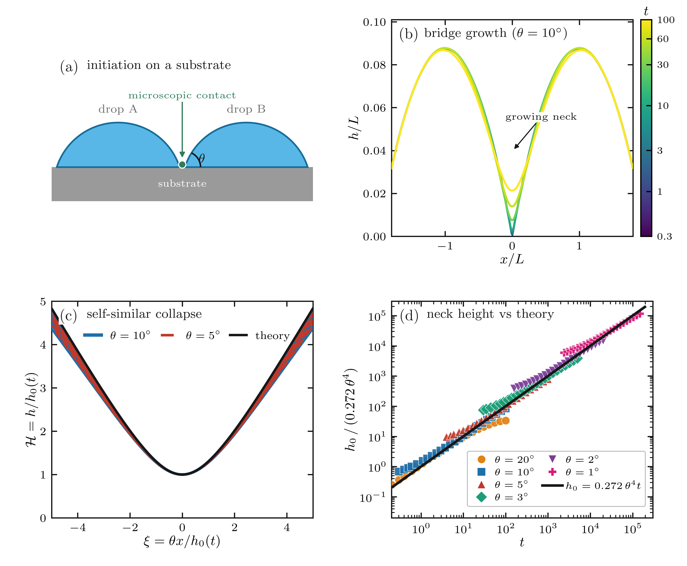

# Figure 5 — sessile-drop coalescence (source)

Source code and data-reduction pipeline for **Figure 5** of the *Contemporary
Physics* review *Singularities in Soft Matter Systems*. The figure shows
coalescence as a constructive singularity for two viscous **sessile** drops and
demonstrates self-similarity / loss of memory.

The hydrodynamics are the **clean** (surfactant-free, `beta = Pe = 0`) limit of
the sessile-drop lubrication model of Talukdar et al. The early-time viscous
neck law and the constant `0.272` are from Hernández-Sánchez et al., *Symmetric
and asymmetric coalescence of drops on a substrate*, Phys. Rev. Lett. **109**,
184502 (2012), [arXiv:1207.2635](https://arxiv.org/abs/1207.2635).

## Panels

- **(a)** schematic: two spherical caps meeting at a microscopic contact on a substrate.
- **(b)** simulated free-surface profiles `h(x,t)` for `theta = 10°` (bridge growth).
- **(c)** self-similar collapse `H = h/h0(t)` vs `xi = theta x / h0(t)` for
  `theta = 5°, 10°`, overlaid with the **theory** master curve (shooting solution
  of the similarity ODE). Normalising by the *measured* neck height `h0(t)`
  removes the early-time amplitude drift and gives a tight collapse.
- **(d)** neck height compensated by `0.272 theta^4` collapses six contact angles
  (`theta = 1°…20°`) onto the universal line `h0 = 0.272 theta^4 t`.

## Pipeline

```
coalescence_clean.py   ->  reduce_fig5.py        ->  make_fig5_coalescence.py  ->  fig5_coalescence.pdf
(pyoomph simulation)       (snapshots -> .npz)       (assembles all panels)
                                                  +
similarity_solution.py ->  similarity_master.csv ---/   (theory curve for panel c)
```

1. **Simulate** each contact angle with `coalescence_clean.py` (pyoomph,
   finite elements + adaptive refinement). Writes `domain/domain_*.txt`
   (columns `x, h, p`).
2. **Reduce** each run with `reduce_fig5.py <run_dir> <theta_deg> <out.npz>` to a
   compact bundle (`fig5_data_theta<deg>.npz`): bridge-history profiles, the
   self-similar-window snapshots in `(xi, H)`, and the full neck history
   `h0(t)`. The collapse window is the early-time self-similar band
   `h0/(theta^4 t) in [0.27, 0.30]`. Bundles live in `fig5_coalescence_data/`.
3. **Theory** master curve: `similarity_solution.py` solves the similarity ODe by
   shooting and writes `similarity_master.csv` (used by panel c).
4. **Figure**: `make_fig5_coalescence.py` reads the bundles + master curve and
   writes `fig5_coalescence.pdf` / `.png`.

## Similarity ODE (panel c theory)

With `h = h0(t) F(eta)`, `eta = x/w`, `h0 = c theta^4 t`, `w = h0/theta`, the clean
lubrication equation `h_t = -(h^3 h_xxx / 3)_x` reduces to the autonomous ODE

```
(F^3 F''')' = 3 c (eta F' - F),
F(0)=1, F'(0)=0, F'''(0)=0,   F'(inf)=1, F''(inf)=0.
```

`F(eta) = H(xi)` is the master curve. Fixing `c = 0.272` (the simulation value)
and shooting on the neck curvature `F''(0)` gives `F''(0) = 0.6607` and
`F''(inf) ≈ 0` (|F''| < 4e-3), confirming `0.272` is the eigenvalue.

## Per-angle simulation parameters

All runs: precursor `hp = 1e-4`, domain `[-3, 3]`, base mesh `N = 5000`.

| theta | refine | t_end   | outstep | maxstep | command |
|------:|:------:|--------:|--------:|--------:|---------|
| 20°   | 6      | 100     | 0.1     | 50      | `python coalescence_clean.py --theta-deg 20 --t-end 100 --outstep 0.1 --max-refine 6` |
| 10°   | 6      | 100     | 0.1     | 50      | `python coalescence_clean.py --theta-deg 10 --t-end 100 --outstep 0.1 --max-refine 6` |
| 5°    | 7      | 1000    | 1.0     | 50      | `python coalescence_clean.py --theta-deg 5 --t-end 1000 --outstep 1 --max-refine 7` |
| 3°    | 7      | 5000    | 5.0     | 200     | `python coalescence_clean.py --theta-deg 3 --t-end 5000 --outstep 5 --max-refine 7 --maxstep 200` |
| 2°    | 7      | 20000   | 20.0    | 500     | `python coalescence_clean.py --theta-deg 2 --t-end 20000 --outstep 20 --max-refine 7 --maxstep 500` |
| 1°    | 7      | 150000  | 150.0   | 2000    | `python coalescence_clean.py --theta-deg 1 --t-end 150000 --outstep 150 --max-refine 7 --maxstep 2000` |

Small angles need much longer end-times: the self-similar onset scales as
`hp/(0.272 theta^4)` (≈ 0.025 for 20° but ≈ 4000 for 1°). A grid-refinement
check (`theta = 10°`, `N = 5000 -> 8000`, refine `6 -> 9`) showed the collapse is
already mesh-converged; the residual wing spread in panel (c) is physical
(self-similarity holds only for `xi << theta/h0`), not a resolution effect.

## Reproduce

```bash
# 1. simulations (per the table above; needs pyoomph)
python coalescence_clean.py --theta-deg 10 --t-end 100 --outstep 0.1 --max-refine 6
# ... repeat for 1, 2, 3, 5, 20 ...

# 2. reduce each run
python reduce_fig5.py coalescence_clean_theta10 10 fig5_coalescence_data/fig5_data_theta10.npz
# ... repeat ...

# 3. theory curve
python similarity_solution.py        # writes similarity_master.csv

# 4. assemble the figure
python make_fig5_coalescence.py      # writes fig5_coalescence.pdf and .png
```

## Files

| file | role |
|------|------|
| `lubrication_clean.py`       | thin-film (lubrication) equations for pyoomph |
| `coalescence_clean.py`       | pyoomph driver (one contact angle per run) |
| `reduce_fig5.py`             | snapshots -> compact `.npz` bundle |
| `similarity_solution.py`     | shooting solver for the similarity master curve |
| `similarity_master.csv`      | precomputed master curve `(xi, H)` |
| `make_fig5_coalescence.py`   | assembles all four panels |

## Dependencies

- Simulation: [`pyoomph`](https://pyoomph.github.io) (wraps oomph-lib; JIT via tccbox).
- Reduction / figure: `numpy`, `matplotlib` (LaTeX text rendering), `scipy`
  (similarity ODE only).

The companion pyoomph project (with the full surfactant model) is at
<https://github.com/comphy-lab/coalescence-with-surfactants>.

## Preview


